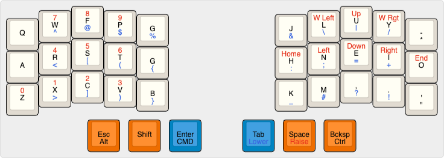

# Custom Corne Keyboard Layout

The keyboard layout is specified in markdown, to make it easier to read and write
([prettier](https://prettier.io) can take care of aligning the table columns).

The markdown tables are converted into `config/corne.keymap` by `generate_keymap.py`.

## Default Layer

The default layer is Colemak. With special characters remapped to prioritize
commonly used characters in day-to-day writing.

All modifier and layer change keys are on the thumb keys via hold-tap keys.
Hold to trigger the modifier, tap to generate the key listed in the row below.

|     |     |     |      |     |     |     |     |      |     |     |
| --- | --- | --- | ---- | --- | --- | --- | --- | ---- | --- | --- |
| Q   | W   | F   | P    | G   |     | J   | L   | U    | Y   | -   |
| A   | R   | S   | T    | D   |     | H   | N   | E    | I   | O   |
| Z   | X   | C   | V    | B   |     | K   | M   | ,    | .   | '   |
|     |     | alt | shft | cmd |     | lwr | rse | ctrl |     |     |
|     |     | ESC |      | RET |     | TAB | SPC | BKSP |     |     |

## Raise Layer (Navigation + Numbers)

|     |     |     |     |     |     |      |              |      |               |     |
| --- | --- | --- | --- | --- | --- | ---- | ------------ | ---- | ------------- | --- |
|     | 7   | 8   | 9   |     |     |      | &kp LA(LEFT) | UP   | &kp LA(RIGHT) |     |
|     | 4   | 5   | 6   |     |     | HOME | LEFT         | DOWN | RIGHT         | END |
| 0   | 1   | 2   | 3   |     |     |      |              |      |               |     |
|     |     |     |     |     |     | adj  |              |      |               |     |
|     |     |     |     |     |     |      |              |      |               |     |

## Lower Layer (Symbols)

The symbol layer is a work-in-progress. The goal is to logically group symbols in a way
that makes sense for use when writing code.

|     |     |     |     |     |     |     |     |     |     |     |
| --- | --- | --- | --- | --- | --- | --- | --- | --- | --- | --- |
|     | ^   | @   | $   | %   |     | &   | \   | \|  | /   |     |
|     | <   | [   | (   | {   |     | \_  | :   | ;   | =   | +   |
|     | >   | ]   | )   | }   |     | \*  | #   | ?   | !   | "   |
|     |     |     |     |     |     |     | adj |     |     |     |
|     |     |     |     |     |     |     |     |     |     |     |

## Adjust Layer (Bluetooth)

|            |              |              |              |              |     |     |     |     |     |     |
| ---------- | ------------ | ------------ | ------------ | ------------ | --- | --- | --- | --- | --- | --- |
| &bt BT_CLR | &bt BT_SEL 0 | &bt BT_SEL 1 | &bt BT_SEL 2 | &bt BT_SEL 3 |     |     |     |     |     |     |
|            |              |              |              |              |     |     |     |     |     |     |
|            |              |              |              |              |     |     |     |     |     |     |
|            |              |              |              |              |     |     |     |     |     |     |
|            |              |              |              |              |     |     |     |     |     |     |

## Keymap Generation

Characters are mapped into zmk equivalents, with a few special cases:

- Two characters in one cell are converted into mod-morph triggered by shift.
- Thumb keys are all hold-tap. First row is hold behavior, second row tap.
- lwr, rse, adj are mapped to layer changes.
